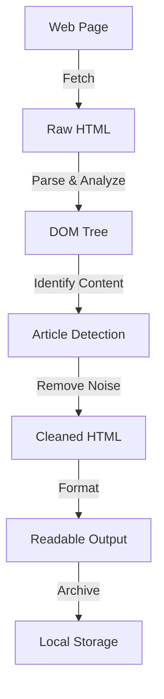

# Declutter

A simple tool to declutter and archive web pages

## Why?

The modern web is drowning in noise. Visiting any article, blog, or news site has become an exhausting gauntlet of distractions:

- **Popups and interstitials** - Newsletter signups, cookie notices, and modal overlays assault you the moment a page loads
- **Ad networks** - Third-party advertisements and sponsored content vie for your attention at every scroll
- **Paywalls and login walls** - Sign-in prompts block access to content before you can even read the headline
- **Navigation clutter** - Massive menus, sidebars, and sticky headers consume precious screen real estate
- **Tracking scripts** - Dozens of analytics and tracking pixels slow down pages while harvesting your behavior

The web was once a place for distraction-free reading and knowledge sharing. Today, even simple blogs and publications are so laden with ads and competing UI elements that finding the actual content feels like navigating a minefield. The signal-to-noise ratio has become unbearable.

## What You Get

Declutter is a CLI tool that strips away all the noise and gives you back what matters: **clean, readable content**. It processes web pages to remove ads, popups, navigation clutter, and other visual distractions, then archives the decluttered version locally for offline reading or long-term preservation.

- Extract core article content free from distractions
- Save clean, readable versions of web pages
- Archive pages for offline access
- Focus on reading, not fighting through UI noise

## How it Works

Declutter analyzes web pages and intelligently removes non-content elements while preserving the actual article or page content. Here's the high-level flow:

**Process breakdown:**

1. **Fetch** - Download the target web page
2. **Parse** - Convert HTML into a structured DOM tree
3. **Detect** - Identify the main content area (article, blog post, etc.)
4. **Clean** - Remove ads, popups, navigation, and clutter elements
5. **Format** - Apply readable styling and layout
6. **Archive** - Save the cleaned version locally for offline access

## Caveats

Declutter works great for most websites, but it's not a universal solution:

- **Not all sites are equal** - Some heavily JavaScript-rendered sites or paywalled content may not be fully supported
- **Dynamic content** - Pages that load content after initial page load may require adjustments
- **Site-specific limitations** - Complex custom layouts on some sites may not be perfectly detected
- **Works best on** - News articles, blog posts, documentation, and article-focused websites

For most traditional web pages and articles, Declutter delivers excellent results. For edge cases and highly customized sites, results may vary.
